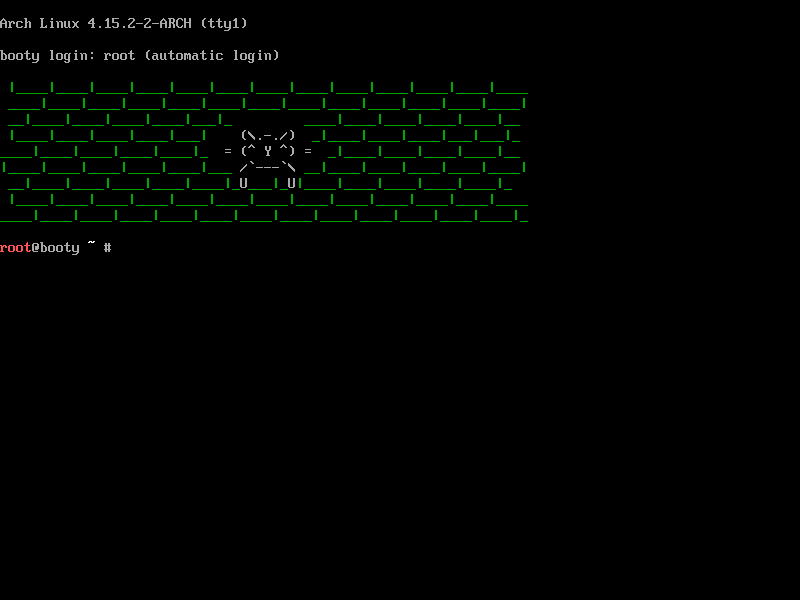

# booty [![Build Status][travis-img]][travis]

[travis-img]:   https://travis-ci.org/kpcyrd/booty.svg?branch=master
[travis]:       https://travis-ci.org/kpcyrd/booty

Minimal forensic/exfiltration/evil-maid/rescue live boot system.

## Build

    git submodule init
    ./build.sh -p
    sudo ./build.sh -v
    ls -lah out/

## Rebuild

    # make sure nothing is mounted anymore
    mount | grep `pwd`
    # remove working directory
    sudo rm -rf work/
    # also force package rebuild
    rm -rf repo/

## Customize

The system is supposed to be easily customizable. See `booty.conf` for some
basic flags that can be set/unset. You need to have ssh access enabled and
setup directly at boot? We've got you covered.

It is recommended to fork the repo and commit your changes, so you can easily
merge upstream changes with your personal config.

## License

GPLv3+
